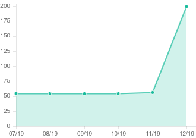
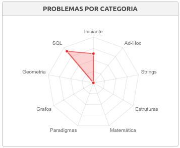
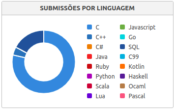

# URI Online Judge - Solutions

All my solutions for problems from [URI Online Judge](https://www.urionlinejudge.com.br/judge/en).

Todas as minhas soluções para problemas do [Juiz Online URI](https://www.urionlinejudge.com.br/judge/pt).

## My Profile
* <b>Name:</b> <a href="https://www.urionlinejudge.com.br/judge/en/profile/242402">Marcos Lima (marcosmapl)</a>
* <b>Country:</b> Brazil
* <b>University:</b> Universidade Federal do Amazonas - <a href="https://www.urionlinejudge.com.br/judge/en/users/university/ufam">UFAM</a>
* <b>Since:</b> 3/26/2018
* <b>Main Rank Position:</b> 3,253º
* <b>Institution Rank Position:</b> 33º

## Progress 09.71 %
* <b>Points:</b> 604.2
* <b>Solved:</b> 198
* <b>Tried:</b> 201
* <b>Submissions:</b> 274
	* [01 - Beginner Problems Solutions 53 %](https://github.com/limadmarcos/uri-solutions/tree/master/01-beginner)
	* [02 - Ad-Hoc Problems Solutions 1 %](https://github.com/limadmarcos/uri-solutions/tree/master/02-ad-hoc)
	* [03 - Strings Problems Solutions 1 %](https://github.com/limadmarcos/uri-solutions/tree/master/03-strings)
	* [09 - SQL Problems Solutions 74 %](https://github.com/limadmarcos/uri-solutions/tree/master/09-sql)
	* [10 - Christmas Contest Solutions](https://github.com/limadmarcos/uri-solutions/tree/master/contest-christmas)

## Progress (Past 6 Months)

## Problems by Category

## Submissions by Answer

## Submissions by Language
